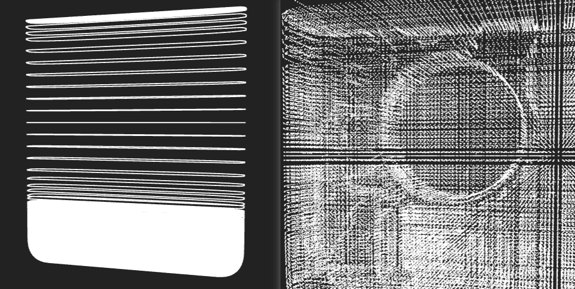
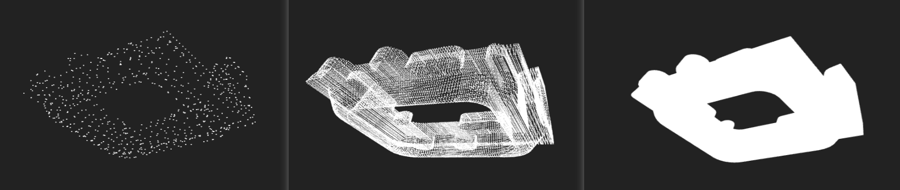
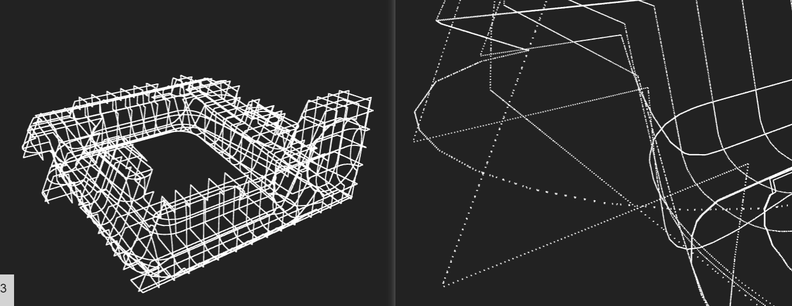
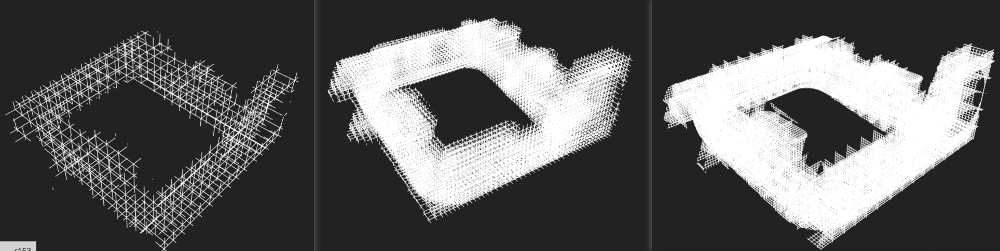
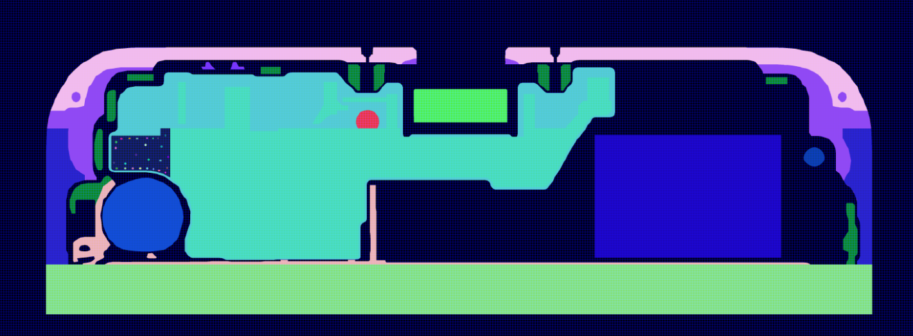

# 概述
这是用来测试大规模加密整机，生成完整电连接信息的测试代码
# 目录
1. [安装](#install)
    1. [下载](#download)
    1. [编译](#compile)
1. [使用方法](#usage)
    1. [输入文件](#input)
    1. [导出 Pointcloud](#export-pointcloud)
    1. [Cell 内加密](#add-sampling)
    1. [导出单个零件](#add-sampling)
    1. [各向异性加密](#add-sampling)
    1. [导出 Dexel](#export-pointcloud)
    1. [导出切面](#export-pointcloud)
1. [实现细节](#perf)
    1. 内存管理（TODO）
    1. 点在三角形内部判断（TODO）
    1. 光栅化（TODO）
1. [性能测试](#perf)
    1. Dexel 生成性能 (TODO)
    1. 光栅化性能 (TODO)
1. [待办事项](#todos)
    1. 区域分解和多卡并行 (TODO)
    1. 双轴光栅化 (TODO)
    1. 破损和非封闭网格处理（TODO）
    1. 交点排序加速（TODO）
## 1. 安装<a id="install"></a>
### 1.1 下载<a id="download"></a>
```bash
git clone $THIS_REPO
git checkout fyf-dev
git submodule update --init --recursive
```
### 1.2 编译<a id="compile"></a>
```bash
nvcc -std=c++17 -O3 -o main deps/lodepng/lodepng.cpp main.cu
```
## 2. 使用方法<a id="usage"></a>
### 2.1 必须的输入文件<a id="input"></a>
1. 几何模型如 `toStudent_EM.stl`
2. 网格位置信息如 `MaterialAndGridLines.json`

### 2.2 导出点云
未加密，一个 Cell 两次采样（顶部一次底部一次），生成整机点云
```bash
./main --load-mesh toStudent_EM.stl --load-grid MaterialAndGridLines.json
```
在 6 核 4 GHz，3090 Ti 上执行，生成点云耗时不到 1 s
```
INFO: loaded 370 x 137 x 76 (3852440) grids
INFO: loaded 107186 faces with 321558 vertices
INFO: using pixel size 2 x 2
PERF: on x group 475441 in 0.028873 s
PERF: on x cast 164862 in 0.033774 s
PERF: on y group 853127 in 0.076936 s
PERF: on y cast 395932 in 0.036983 s
PERF: on z group 2293430 in 0.123098 s
PERF: on z cast 1803166 in 0.116562 s
PERF: cast done in 0.554746 s
```
增加参数 `--dump-cast cast.gltf` 导出点云文件。可以用支持 `gltf` 格式的软件或者工具查看（比如 three.js）

<center>左：整机网格点云；右：底部放大后点云</center>

### 2.3 Cell 内加密
按一个 Cell 64x64 整机加密采样
```bash
./main --load-mesh toStudent_EM.stl --load-grid MaterialAndGridLines.json --cast-pixels 64
```
在同样硬件上执行，约 15 s
```
INFO: loaded 370 x 137 x 76 (3852440) grids
INFO: loaded 107186 faces with 321558 vertices
INFO: using pixel size 64 x 64
PERF: on x group 475441 in 0.027586 s
PERF: on x cast 170392390 in 1.389549 s
PERF: on y group 853127 in 0.067648 s
PERF: on y cast 408646924 in 2.454190 s
PERF: on z group 2293430 in 0.122978 s
PERF: on z cast 1843983034 in 10.629598 s
PERF: cast done in 14.828315 s
```
### 2.4 单独导出一个零件
由于整机加密后导出数据量太大，增加参数 `--mesh-geometry 12` 单独选择一个零件导出。
通过 `--cast-pixels` 设置分辨率为 2、8、64，可见模型充分加密

<center>左：未加密；中：8x8 加密；右：64x64 加密</center>

### 2.5 各向异性加密
可设置 `--cast-pixels` 为逗号分隔的两个整数，如 `64,2`，可后续用于生成加密的切面信息

<center>左：各向异性加密的点云；右：点云局部放大</center>

### 2.6 导出 Dexel
增加 `--dump-cast-mode dexel` 用于导出 dexel 格式

<center>左：未加密 Dexel；中：4x4 加密；右：8x2 加密</center>

### 2.7 导出切面
通过各向异性加密后，可以将网格线上的加密 Dexel 进行光栅化生成图片，添加参数 `--dump-render` 导出切面到文件夹

<center>按照 16x2 加密生成的切面图片</center>

## 3. 实现细节
TODO
## 4. 性能测试
TODO
## 4. 待办事项
TODO
